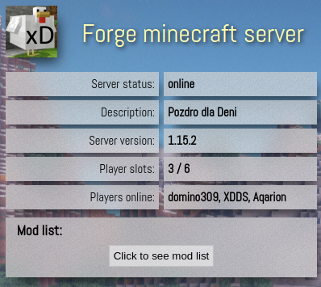
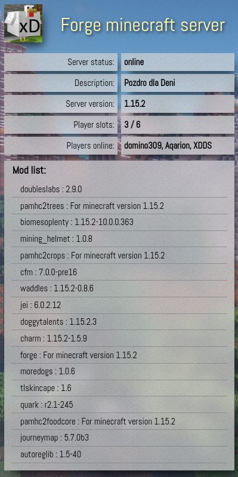

# Minecraft Forge server status
A simple API and frontend that provides information about a Forge Minecraft server such as:
* online status,
* description,
* version,
* number of slots,
* the number of online players with their nicknames,
* mod list with version,
* server icon.

I've recently started hosting a Forge Minecraft server to play with my friends. I find it helpful to be able to check on my mobile, e.g, who's currently playing. I decided to make a simple web app with server info. The existing API's were, at least, unsatisfying for me. So I decided to make one myself. 
 \
The backend is located in `src/main`, the frontend in `src/main`.

#UPDATE
The status REST endpoints have been moved `/` -> `/api` and `/fixed` -> `/api/fixed`!
\
Moreover, I've implemented a server-side frontend version that is available under `/`. This version uses the Thymeleaf template engine.
# How to use it
To use this application, you must configure the backend first.
Open the `src/main/resources/application.properties` file and set the host address (optionally the port, if needed). You also can change the timeout and allowed origins but I recommend leaving it unchanged.
You can run the backend standalone or on a dedicated enterprise server (e.g. TomEE).
 \
The only thing you need to do to configure the fronted is to put the backend URL in the **9th line of `index.html`**.
The backend has two endpoints:
* /api/ - server status without fixing mods version
* /api/fixed - server status with fixing mods version

I recommend putting the frontend in a separate directory on your webserver. You can put the status banner on your website using an iframe. The frame will adjust its width and height after fetching the data or pressing the mod list button. The important thing to notice is that the frame id and title must be identical, e.g.: \
```<iframe id="mcFrame" name="mcFrame" src="minecraft/index.html" title="minecraft status"></iframe>```

You can also use the server-side frontend, e.g.:\
```<iframe id="mcFrame" name="mcFrame" src="http://localhost:8080/" title="minecraft status"></iframe>```

# How it works
For the backend, I use java and spring. The backend pings the server using raw sockets. Then it parses received JSON and converts it to the form I find more useful. Unfortunately, sometimes mods versions are reported as "version" or "ANY" string. I fix that by replacing the string with more useful information.
The frontend is written pure html5, css3, and javascript. It's intended to be used in an iframe. It presents the best on the Chromium-based browser. On Firefox, the background behind fields is not blurry but despite this, it still looks nice.

# Visuals
If you wonder how the frontend looks, grab some visuals! \
 \

